# 🚀 Walleter - Cardano Learning Hub

A comprehensive Next.js application for learning Cardano blockchain development with hands-on examples of **Aiken**, **Mesh SDK**, **Blockfrost**, and **Wallet integration**.

## 🎯 What You'll Learn

### 1. **Smart Contracts with Aiken** 
- ✅ Basic validator logic (Hello World)
- ✅ Complex marketplace contracts  
- ✅ NFT minting policies
- ✅ Data validation and security

### 2. **Frontend with Mesh SDK**
- ✅ Wallet connection & management
- ✅ Transaction building & signing
- ✅ Asset querying & display
- ✅ Smart contract interaction

### 3. **Blockchain API with Blockfrost**
- ✅ Reading blockchain data
- ✅ Submitting transactions
- ✅ Querying UTXOs
- ✅ Real-time updates

### 4. **User Experience with Wallets**
- ✅ Multi-wallet support (Nami, Eternl, etc.)
- ✅ Secure transaction signing
- ✅ Asset management
- ✅ Network switching

## 🛠️ Tech Stack

- **[Next.js](https://nextjs.org/)** - React framework
- **[TypeScript](https://www.typescriptlang.org/)** - Type safety
- **[Tailwind CSS](https://tailwindcss.com/)** - Styling
- **[Mesh SDK](https://meshjs.dev/)** - Cardano integration
- **[Aiken](https://aiken-lang.org/)** - Smart contract language
- **[Blockfrost](https://blockfrost.io/)** - Blockchain API

## 🚀 Quick Start

### Prerequisites
- Node.js 18+
- A Cardano wallet (Nami, Eternl, etc.)
- Test ADA from [Cardano Faucet](https://docs.cardano.org/cardano-testnets/tools/faucet/)

### Installation

1. **Clone and install:**
```bash
git clone https://github.com/indunil-k/Walleter.git
cd Walleter
npm install
```

2. **Get Blockfrost API Key:**
   - Visit [blockfrost.io](https://blockfrost.io)
   - Create account and new project
   - Select "Cardano Preprod" network
   - Copy your API key

3. **Configure environment:**
```bash
# Create .env.local file
NEXT_PUBLIC_BLOCKFROST_API_KEY_PREPROD=preprod_your_api_key_here
```

4. **Run development server:**
```bash
npm run dev
```

5. **Open [http://localhost:3000](http://localhost:3000)**

## 📚 Learning Projects

### 🔰 **Beginner: Hello World Contract**
**Path:** `/hello`

Learn smart contract fundamentals:
- Lock ADA with your wallet signature
- Unlock with correct message ("Hello, World!")
- Understand datums, redeemers, and validation

**Key Concepts:**
- Basic Aiken syntax
- Transaction building
- Wallet signing process

### 🔥 **Intermediate: NFT Marketplace**
**Path:** `/marketplace`

Build a complete marketplace:
- List NFTs for sale with prices
- Buy NFTs with automatic payments
- Cancel listings (seller only)
- Complex validation logic

**Key Concepts:**
- Advanced smart contracts
- Payment validation
- NFT asset handling
- User permissions

### 🎨 **Advanced: NFT Minting**
**Path:** `/mint`

Create unique digital assets:
- Mint NFTs with custom metadata
- Follow CIP-25 standards
- Create token policies
- Handle asset creation

**Key Concepts:**
- NFT standards
- Metadata management
- Token policies
- Asset creation

## 🔧 Project Structure

```
walleter/
├── contracts/           # Aiken smart contracts
│   └── marketplace.ak   # NFT marketplace contract
├── src/pages/           # Next.js pages
│   ├── index.tsx       # Learning hub homepage
│   ├── hello.tsx       # Hello World contract demo
│   ├── marketplace.tsx # NFT marketplace
│   └── mint.tsx        # NFT minting tool
├── .env.local          # Environment configuration
└── README.md           # This file
```

## 💡 How The Tools Work Together

```mermaid
graph LR
    A[🎨 Aiken Contracts] --> B[🔗 Mesh SDK]
    B --> C[🌐 Blockfrost API]
    C --> D[⛓️ Cardano Blockchain]
    E[👛 User Wallet] --> B
    B --> F[💻 Next.js Frontend]
```



| Tool | Purpose | In This Project |
|------|---------|----------------|
| **Aiken** | Write smart contracts | `contracts/marketplace.ak` - Validation logic |
| **Mesh SDK** | Build transactions | All pages - Wallet connection & tx building |
| **Blockfrost** | Blockchain API | Environment config - Data fetching |
| **Wallets** | User interface | All pages - Signing & authentication |

## 🎓 Learning Path

1. **Start with Hello World** (`/hello`)
   - Understand basic concepts
   - Practice wallet connection
   - Learn transaction flow

2. **Explore the Marketplace** (`/marketplace`)
   - See complex smart contracts
   - Understand NFT trading
   - Learn payment validation

3. **Try NFT Minting** (`/mint`)
   - Create your own assets
   - Understand metadata standards
   - Practice asset management

4. **Study the Code**
   - Read the Aiken contracts
   - Understand Mesh SDK usage
   - See how Blockfrost integrates

## 🔍 Code Examples

### Aiken Smart Contract
```aiken
validator marketplace {
  spend(datum_opt: Option<Datum>, redeemer: Redeemer, _input, tx) {
    expect Some(datum) = datum_opt
    
    when redeemer.action {
      "buy" -> {
        let signed_by_buyer = list.has(tx.extra_signatories, redeemer.buyer)
        let seller_gets_paid = check_payment(tx, datum.seller, datum.price)
        signed_by_buyer && seller_gets_paid
      }
      "cancel" -> list.has(tx.extra_signatories, datum.seller)
      _ -> False
    }
  }
}
```

### Mesh SDK Integration
```typescript
const contract = new MeshHelloWorldContract({
  mesh: meshTxBuilder,
  fetcher: provider,
  wallet: wallet,
  networkId: 0,
});

const tx = await contract.lockAsset(assets);
const signedTx = await wallet.signTx(tx);
const txHash = await wallet.submitTx(signedTx);
```

### Blockfrost Configuration
```typescript
const provider = new BlockfrostProvider(
  process.env.NEXT_PUBLIC_BLOCKFROST_API_KEY_PREPROD!
);
```

## 🤝 Contributing

1. Fork the repository
2. Create a feature branch
3. Make your changes
4. Test thoroughly
5. Submit a pull request

## 📖 Additional Resources

- **[Aiken Documentation](https://aiken-lang.org/language-guide/getting-started)**
- **[Mesh SDK Docs](https://meshjs.dev/)**
- **[Blockfrost API Reference](https://docs.blockfrost.io/)**
- **[Cardano Developer Portal](https://developers.cardano.org/)**

## 📄 License

MIT License - see [LICENSE](LICENSE) file for details.

---

**🎯 Ready to build on Cardano?** Start with `/hello` and work your way up! Each project builds on the previous one, giving you a complete understanding of the Cardano development ecosystem.
